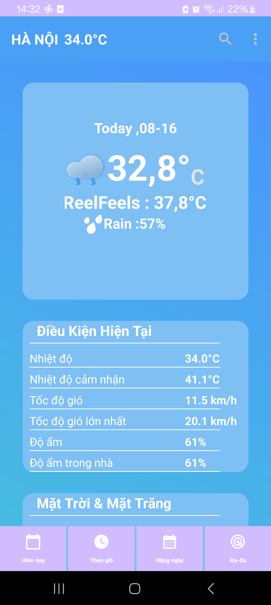
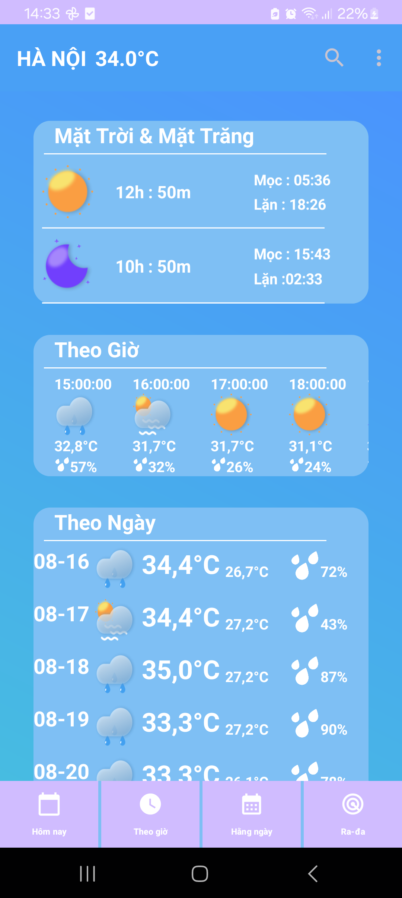
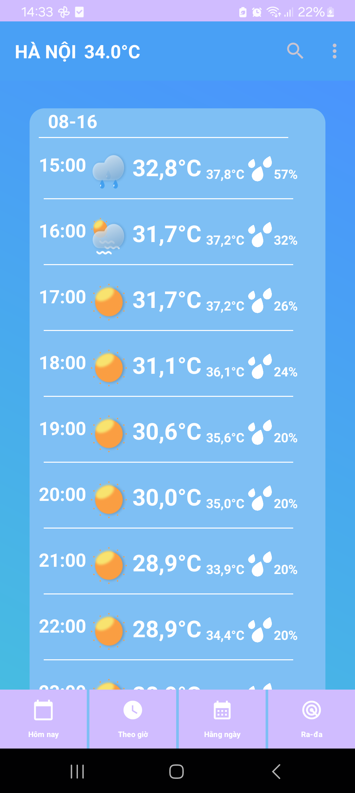
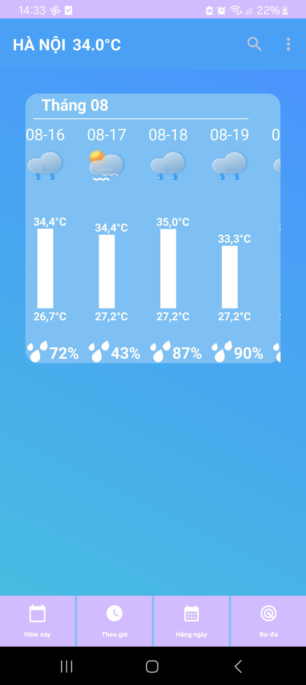

# WeatherApp

## Mô tả
WeatherApp là một ứng dụng đơn giản giúp người dùng tra cứu thông tin thời tiết hiện tại và dự báo thời tiết trong những ngày tới. Ứng dụng cung cấp dữ liệu thời tiết từ một dịch vụ API thời tiết phổ biến.
## Ảnh màn hình
Dưới đây là một số hình ảnh màn hình của ứng dụng:

*Màn hình chính hiển thị thông tin thời tiết hiện tại.*

*Màn hình phụ hiển thị thời tiết trong các giờ trong ngày và các ngày tới*
## Tính năng
- Hiển thị thời tiết hiện tại dựa trên vị trí của người dùng.
- Tìm kiếm và tra cứu thời tiết cho bất kỳ thành phố nào trên thế giới.
- Cung cấp dự báo thời tiết cho 7 ngày tiếp theo.
- Hiển thị các thông tin chi tiết như nhiệt độ, độ ẩm, tốc độ gió, và khả năng mưa.
- Giao diện người dùng thân thiện và dễ sử dụng.

## Yêu cầu hệ thống
- Android Studio 4.0 trở lên (cho ứng dụng Android).
- Phiên bản Android 5.0 (Lollipop) trở lên.
- Kết nối internet để truy cập dữ liệu thời tiết.

## Cài đặt
1. Clone repo từ GitHub:
2. Mở dự án trong Android Studio.
3. thêm apikey accuweather của bạn vào file Api
3. Build và chạy ứng dụng trên thiết bị hoặc trình giả lập.

## Sử dụng
- **Tra cứu thời tiết hiện tại**: Ứng dụng sẽ tự động lấy vị trí của bạn và hiển thị thông tin thời tiết hiện tại.
- **Tìm kiếm thành phố**: Nhập tên thành phố vào ô tìm kiếm để tra cứu thời tiết tại vị trí đó.
- **Xem dự báo thời tiết**: Chạm vào nút "Dự báo" để xem dự báo thời tiết trong 7 ngày tới.

## Công nghệ sử dụng
- **Ngôn ngữ**: Kotlin/Java.
- **Framework**: Android SDK.
- **API**: AccuWeather API
- **Thư viện**: Retrofit, Glide,..

## Đóng góp
1. Fork dự án.
2. Tạo một nhánh tính năng (`git checkout -b feature/your-feature`).
3. Commit các thay đổi của bạn (`git commit -m 'Thêm tính năng mới'`).
4. Push nhánh lên (`git push origin feature/your-feature`).
5. Tạo một pull request để hợp nhất các thay đổi của bạn.

## Tác giả
- **Ireone01** - [GitHub]([https://github.com/yourusername](https://github.com/ireone01))

## Ứng dụng còn nhiều thiếu sót , mong được học hỏi từ mọi người
